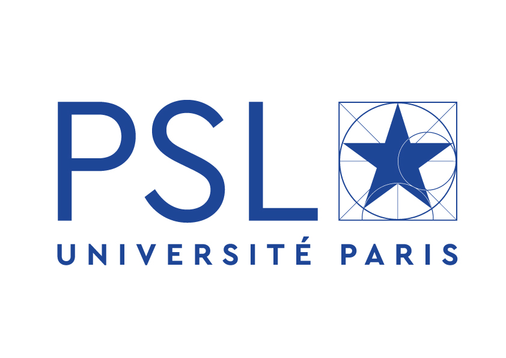

Welcome to the "Sparsity for Physics, Signal and Learning" summer school.

Where and when
============================

  * **June 24th - 27th 2019**
  * **INRIA - Paris, 2 rue Simone Iff, 75012 Paris, France.**

Registration
============================

Coming soon.

Topics
===========================
[comment]: # Dans de nombreux domaines des sciences, de l'industrie et de leurs applications, la bonne approximation de fonctions et de signaux définis dans des espaces en grande dimension joue un rôle central dans des tâches de prédiction et prise de décision. Dans ce contexte, il est important d'exploiter les propriétés de parcimonie des signaux et d'exploiter le plus efficacement possible les données à disposition. La parcimonie et la forme des données est très variable en fonction des applications et demande des compétences transverses. Dans l'école d'été Sparsity4PSL, nous souhaitons donner un aperçu de cette variabilité et montrer les fondements de méthodes parcimonieuses actuelles dans diverses thématiques clés comme le traitement d'image, la résolution d'EDP paramétrées et le traitement de grandes masses de données.

This summer school will be the opportunity to bring together students, researchers and people working on Sparsity and its applications to High-Dimensional Data. It will include four courses at Master/PhD level (no background required) and four additional talks on modern applications of sparse methods in domains such as imaging, parametric PDE, and large-scale data processing. The mathematical foundations of this event will lie between probability, statistics, optimization, image and signal processing.

Speakers
===========================
#### Courses
* [Yohann De Castro](https://ydecastro.github.io/) (ENPC)
* [Emilie Chouzenoux](http://www-syscom.univ-mlv.fr/~chouzeno/) (Paris Est Marne-la-Vallée)
* [Karen Veroy-Grepl](https://www.aices.rwth-aachen.de/en/about-aices/people/principal-investigators/details-zur-person/veroy-grepl) (RWTH-Aachen)
* [Bernard Haasdonk](https://www.ians.uni-stuttgart.de/institute/team/Haasdonk-00005/) (Stuttgart University)

#### Talks
* [Albert Cohen](https://www.ljll.math.upmc.fr/cohen/) (Sorbonne Universités)
* [Yvon Maday](https://www.ljll.math.upmc.fr/maday/) (Sorbonne Universités)
* [Laure Blanc-Féraud](http://www-sop.inria.fr/members/Laure.Blanc_Feraud/) (CNRS)
* [Rémi Gribonval](https://people.irisa.fr/Remi.Gribonval/) (INRIA)

Organizers
===========================
* [Vincent Duval](https://who.rocq.inria.fr/Vincent.Duval/index.html) (INRIA)
* [Olga Mula](https://www.ceremade.dauphine.fr/~mula/) (Université Paris Dauphine)
* [Nicolas Keriven](https://nkeriven.github.io/) (ENS)
* [Gabriel Peyré](http://www.gpeyre.com/) (CNRS, ENS)

Supported by
===========================

The summer school is supported by the ERC grant [NORIA](http://www.gpeyre.com/noria).
